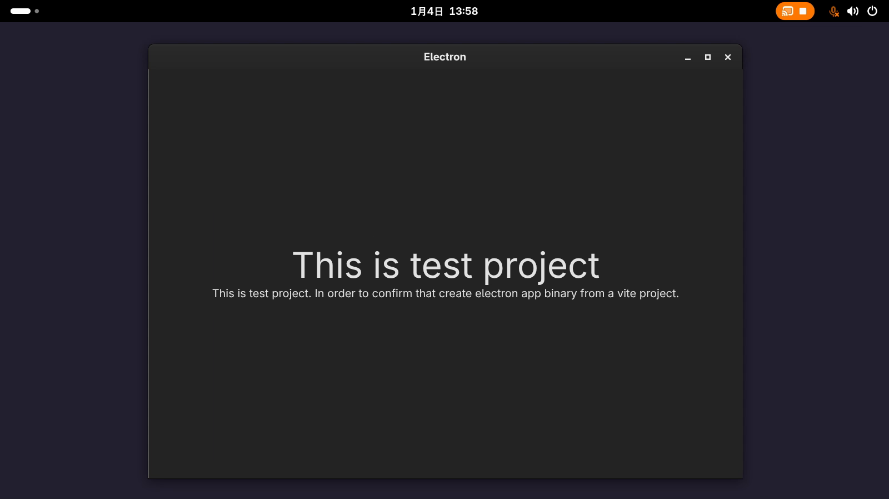

# A-Create-Electron-App-Test-from-a-Vite-Project
This is my example of electorn app from a vite project that does not include electron.

# How to build and run
```
cp -r ./src/* ./createElectornAppTest/src/renderer/src/
cd createElectornAppTest
npm run build:linux
# npm run build:win
# npm run build:mac

./dist/createelectornapptest-1.0.0.AppImage
```



# My blog post
- Vite を使って作ったものを Electron アプリとしてバイナリ化する | nyanmo main blog   
https://www.nyanmo.info/posts/webdevelop/electron/createelectronappbinraryfromaviteproject/ (2026年1月4日) 


# Ref
- electron-builder - electron-builder   
https://www.electron.build/electron-builder/globals (2026年1月4日) 
- Tailwind CSS - Rapidly build modern websites without ever leaving your HTML.   
https://tailwindcss.com/ (2026年1月4日) 
- Getting Started | electron-vite   
https://electron-vite.org/guide/ (2026年1月4日) 
- Google Gemini   
https://gemini.google.com/app (2026年1月4日) 